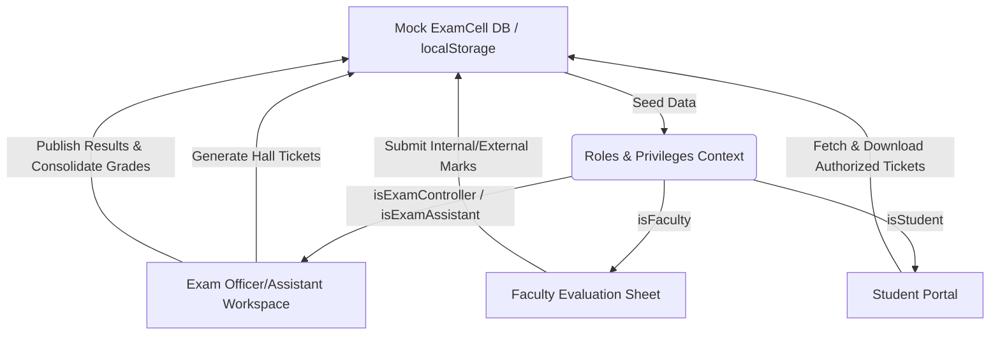

# EduSuite Pro: Examination Management Module

This document details the comprehensive architecture, workflows, sub-modules, and integration mappings of the **Examination Management Module** implemented within EduSuite Pro.

---

## 🏛️ Core Architecture & Data Flow

The Examination module operates on a **decentralized client-side state engine** with real-time browser caching using `localStorage`. This ensures high fidelity and instant persistence without backend latency during presentation reviews.

All data tables (`mock_students_db_v3`, `mock_answer_copy_roster_v3`, `mock_scheduled_exams_v3`, `mock_timetables_v3`, `mock_offered_courses_v3`) are managed dynamically via the service wrapper in **[`mock-examcell-state.ts`](file:///c:/EduTech-CMS/edusuite-pro/src/lib/mock-examcell-state.ts)**.

---

## 🔑 Role & Privilege Escalation

Access controls are integrated directly into the core shell navigation using permission-based flags:
1. **Exam Controller (Officer)**: Unlocked by the `isExamController` flag. Grants full audit, branch-wide analytics, hall ticket overrides, and final result publication rights.
2. **Exam Assistant**: Unlocked by the `isExamAssistant` flag. Grants operational scheduling, timetable builds, course registration checks, and question bank management.
3. **Faculty Evaluator**: Standard faculty view that interacts with answer booklet correction sheets and marks submissions.
4. **Student**: Frontend client fetching hall tickets and transcripts from the synchronized mock database.

---

## 📂 Detailed Sub-Modules & Workflows

The sidebar menu is ordered logically to align with the chronological execution of an academic examination cycle:

### 1. Dashboard
* **Route**: **[`exam-cell-dashboard.tsx`](file:///c:/EduTech-CMS/edusuite-pro/src/components/dashboard/role/exam-cell-dashboard.tsx)**
* **Features**: Displays branch-wide high-level KPI metrics (Upcoming papers, issued hall tickets, correction completion %).
* **Reset Action**: Features a **"Reset Demo Data"** action that wipes the custom storage keys and re-seeds default parameters.

### 2. Course & Exam Enroll
* **Route**: **[`updates.tsx`](file:///c:/EduTech-CMS/edusuite-pro/src/routes/examcell/updates.tsx)**
* **Workflow**: Validates student registrations, monitors course-level enrollments, and signs off on branch approvals.

### 3. Schedule Exam
* **Route**: **[`examinations.schedule.tsx`](file:///c:/EduTech-CMS/edusuite-pro/src/routes/examinations.schedule.tsx)**
* **Workflow**: Establishes date grids, sessions (FN/AN), course codes, and hall capacities for active semesters.

### 4. Timetable Builder
* **Route**: **[`timetable.tsx`](file:///c:/EduTech-CMS/edusuite-pro/src/routes/examcell/timetable.tsx)**
* **Workflow**: Combines class section schedules. Integrates collision checks using **[`checkScheduleConflict`](file:///c:/EduTech-CMS/edusuite-pro/src/modules/timetable/TimetableService.ts)** to prevent invigilator/faculty double-booking.

### 5. Hall Tickets (Override & Audit Flow)
* **Route**: **[`hall-tickets.tsx`](file:///c:/EduTech-CMS/edusuite-pro/src/routes/examcell/hall-tickets.tsx)**
* **Workflow**:
  1. **Blocked Tab**: Audits students blocked by dues or attendance. Provides a **"Pass to Eligible"** override.
  2. **Eligible Tab**: Automatically sorts **Unpublished Students** to the top. Officers select rows in bulk and click **"Generate Hall Tickets"** to authorize them, shifting them to `Published (✓)` status.

### 6. Correction Requests
* **Route**: **[`correction-requests.tsx`](file:///c:/EduTech-CMS/edusuite-pro/src/routes/examcell/correction-requests.tsx)**
* **Workflow**: Controls allocation of physical and digital answer booklets to evaluators.

### 7. Question Bank
* **Route**: **[`questions.tsx`](file:///c:/EduTech-CMS/edusuite-pro/src/routes/examcell/questions.tsx)**
* **Workflow**: Facilitates digital submission and storage of syllabus-aligned question sheets.

### 8. Results (Grade Consolidation)
* **Route**: **[`results.tsx`](file:///c:/EduTech-CMS/edusuite-pro/src/routes/examcell/results.tsx)**
* **Workflow**: Summarizes marks sheets (Total out of 100M and final Grade Letter). Features a **"Publish Results"** command to broadcast finalized grades to the students' profiles.

### 9. Exam Analytics
* **Route**: **[`analytics.tsx`](file:///c:/EduTech-CMS/edusuite-pro/src/routes/examcell/analytics.tsx)**
* **Workflow**: Charts department performances with filters and compiles PDF analysis reports.

### 10. Supplementary Students
* **Route**: **[`supplementary.tsx`](file:///c:/EduTech-CMS/edusuite-pro/src/routes/examcell/supplementary.tsx)**
* **Workflow**: Manages backlog rosters and registers failed candidates for remedial tests.

### 11. Notifications
* **Route**: Configured within navigation shell. Broadcasts urgency alters to students, faculty, and deans.

---

## 🔗 Cross-Module Integrations

* **Student Portal Portal Integration ([`student.examinations.tsx`](file:///c:/EduTech-CMS/edusuite-pro/src/routes/student.examinations.tsx))**: Queries the shared mock state. When the Exam Officer authorizes a student's hall ticket, the student's tab instantly unlocks the **Download PDF** button.
* **Faculty Corrections Portal ([`faculty.evaluation-and-marks.tsx`](file:///c:/EduTech-CMS/edusuite-pro/src/routes/faculty.evaluation-and-marks.tsx))**: Faculty enter marks which update the roster, feeding directly into the Exam Officer's **Results** module for final grade publishing.
