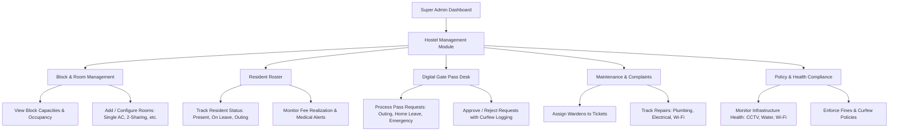
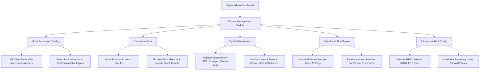
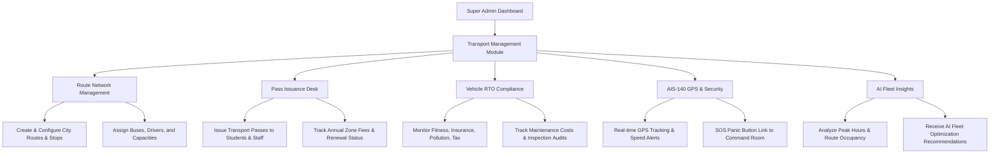

# Super Admin Modules: Hostel, Library & Transport Workflow Specification

This document provides a detailed breakdown and architectural workflow of the **Hostel**, **Library**, and **Transport** sub-systems integrated into the **Super Admin Module** of **EduSuite Pro**.

---

## 🏛️ 1. Hostel Management Sub-System (Super Admin)

### 📌 Core Purpose
Provides centralized administrative control over multi-block campus accommodation, room allocations, student resident records, digital gate passes, maintenance tickets, mess governance, and health & safety compliance.

### 🔄 End-to-End Operational Workflow

### 🎯 Key Capabilities & Features Built
1. **Block & Room Management:**
   - Real-time occupancy tracking for **Block A (Boys)**, **Block B (Girls)**, and **Block C (PG Scholars)**.
   - Dynamic room creation supporting multiple room types (`Single AC`, `2-Sharing AC`, `2-Sharing Non-AC`, `3-Sharing Non-AC`).
   - Automated room status tracking (`Available`, `Full`, `Maintenance`).
2. **Resident Student Tracking:**
   - Full student profile mapping including Roll No, Department, Year, Allocated Block/Room, Contact, Emergency Contacts, and Medical Alerts (e.g., Asthma, Allergies).
   - Real-time resident state tracking (`Present`, `On Leave`, `Weekend Outing`, `Suspended`).
3. **Digital Gate Pass System:**
   - Automated workflow for **Outing Passes**, **Home Leaves**, and **Emergency Passes**.
   - Status management (`Pending`, `Approved`, `Rejected`, `Late Return`, `Resolved`) with approval time tracking and curfew violation alerts.
4. **Maintenance & Complaint SLA:**
   - Maintenance ticketing across categories (Plumbing, Electrical, Wi-Fi, Furniture) with priority levels (`High`, `Medium`, `Low`).
   - Direct assignment to Wardens and real-time SLA completion updates.
5. **Infrastructure Health & Compliance Matrix:**
   - Overall Hostel Health Score (e.g. 96%) covering 24/7 Electricity Grid, Water Supply Tanks (98%), 1 Gbps Wi-Fi, 128 CCTV Cameras, and Municipal Fire Safety Certifications.

---

## 📚 2. Library Management Sub-System (Super Admin)

### 📌 Core Purpose
Automates the physical book cataloging, digital e-resource subscriptions, circulation desk (issue/return), overdue fine management, and RFID/barcode infrastructure monitoring across all campus libraries.

### 🔄 End-to-End Operational Workflow

### 🎯 Key Capabilities & Features Built
1. **Catalog & Accession Master:**
   - Accession Number indexing (`ACC-xxxxx`), ISBN registration, Author, Title, Rack assignment (e.g., `Rack CS-04`), and category classification (`Computer Science`, `Electronics`, `Mechanical`, `AI & Data Science`, `General Science`).
   - Single-click book addition and live copy availability status.
2. **Issue & Return Circulation Workflow:**
   - Streamlined book issuing referencing Student Roll No, Book Accession No, Issue Date, and calculated Due Date (default 14 days).
   - One-click book return verification with instant replenishment of available copies.
3. **Overdue & Fine Realization Engine:**
   - Real-time calculation of pending fines based on customizable daily fine rates (₹10/day after grace period).
   - Department-wise overdue analytics and critical overdue alerts (>15 days delay).
4. **Digital Library & E-Resource Governance:**
   - Centralized management of digital journal portals (**IEEE Xplore**, **SpringerLink**, **Elsevier ScienceDirect**, **ACM Digital Library**, **NPTEL**, **NDLI**).
   - License seat tracking, IP-range authorization, and usage analytics (downloads/month).
5. **Library Health & RFID Infrastructure:**
   - Automated system health index (98% operational score) tracking KOHA ERP database sync, RFID Smart Gates (12 gates online), and Barcode Scanners.

---

## 🚌 3. Transport Management Sub-System (Super Admin)

### 📌 Core Purpose
Provides complete fleet management, route optimization, vehicle RTO compliance tracking, student/faculty transport pass issuance, and live AIS-140 GPS security monitoring.

### 🔄 End-to-End Operational Workflow

### 🎯 Key Capabilities & Features Built
1. **Bus Route & Stop Management:**
   - Management of route categories (**City Express**, **Suburban Feeder**, **Metro Link**, **Staff Shuttle**).
   - Bus assignment, driver allocation with phone contacts, seat capacity tracking (e.g. 50 seats), route stop sequencing, and route status (`Active`, `Maintenance`).
2. **Transport Pass & Zone Fee Engine:**
   - Multi-tier transport pass generation (**Single Zone**, **Double Zone**, **Full Zone**, **Staff Special Shuttle Pass**).
   - Categorization by Student vs Faculty, annual fee calculation (₹28,000 - ₹35,000), payment status tracking (`Paid`, `Pending`), and auto-renewal alerts.
3. **Fleet RTO Compliance Matrix:**
   - Complete safety and legal compliance auditing per commercial bus:
     - Commercial RTO Permit Status & Expiry
     - Comprehensive Fleet Insurance Clearance
     - RTO Fitness Certificate Validity
     - BS-VI Pollution Under Control (PUC) Certification
     - Mandatory Fire Extinguisher & First Aid Kit Inspection
4. **AIS-140 GPS & Telematics Security:**
   - Integration with AIS-140 compliant GPS telematics with speed cap enforcement (55 km/h), route deviation warnings, and SOS panic button integration with Campus Security Command.
   - On-time performance metrics (98.4%) and delay tracking.
5. **AI-Powered Fleet Analytics:**
   - Intelligent recommendations for fleet optimization (e.g., identifying low-utilization routes, suggesting additional buses for 100% capacity routes, and alerting on driver license renewals).

---

## 🛠️ Summary of Created Technical Assets

| Component / Module | Implementation File | Key Responsibilities |
| :--- | :--- | :--- |
| **Hostel Service** | `src/modules/hostel/HostelService.ts` | Data models, block/room APIs, gate pass management, maintenance ticketing, health matrix |
| **Hostel UI Components** | `src/modules/hostel/HostelComponents.tsx` | Interactive block viewer, resident tables, pass approval dialogs, compliance dashboards |
| **Library Service** | `src/modules/library/LibraryService.ts` | Book catalog models, circulation APIs, digital subscription manager, overdue fine engine |
| **Library UI Components** | `src/modules/library/LibraryComponents.tsx` | Catalog management UI, issue/return forms, digital subscription tables, health scorecards |
| **Transport Service** | `src/modules/transport/TransportService.ts` | Bus route models, pass issuance APIs, RTO compliance tracker, GPS telematics interface |
| **Transport UI Components** | `src/modules/transport/TransportComponents.tsx` | Interactive route viewer, pass desk, vehicle compliance grid, AI fleet analytics panel |

---

## 🚀 How to Access in Super Admin Module
1. Navigate to the **Super Admin Portal**.
2. Select **Hostel Management**, **Library Management**, or **Transport Management** from the module navigation bar.
3. Explore the interactive tabs for **Overview**, **Records/Routes/Catalog**, **Passes/Issues/Complaints**, **Compliance/Health**, and **AI Analytics**.
