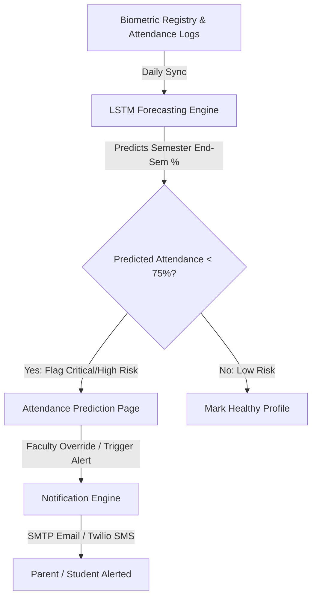
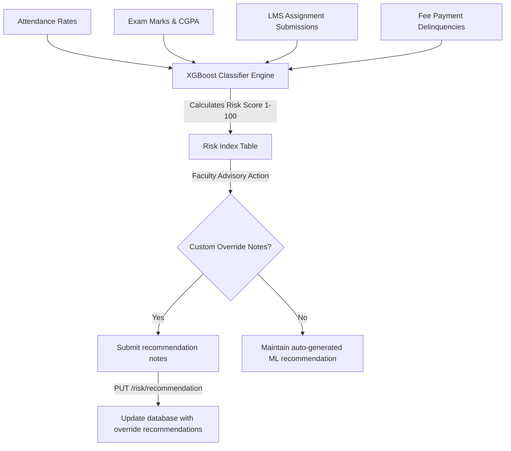
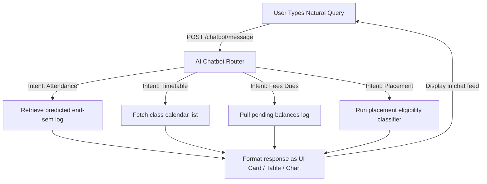

# AI & Analytics Module Workflows

This document visualizes and maps the operational pipelines of key features in the AI module.

## 1. Attendance Prediction Pipeline

---

## 2. Student Risk Assessment Pipeline

---

## 3. Conversational AI Chatbot Pipeline

