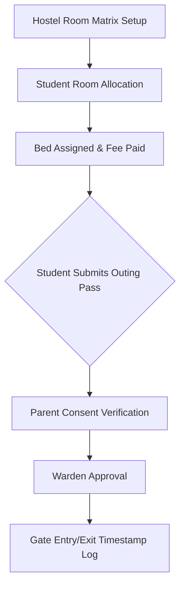

# Hostel Allocation & Outing Workflow

```mermaid
graph TD
  A[Hostel Room Matrix Setup] --> B[Student Room Allocation]
  B --> C[Bed Assigned & Fee Paid]
  C --> D{Student Submits Outing Pass}
  D --> E[Parent Consent Verification]
  E --> F[Warden Approval]
  F --> G[Gate Entry/Exit Timestamp Log]
```
