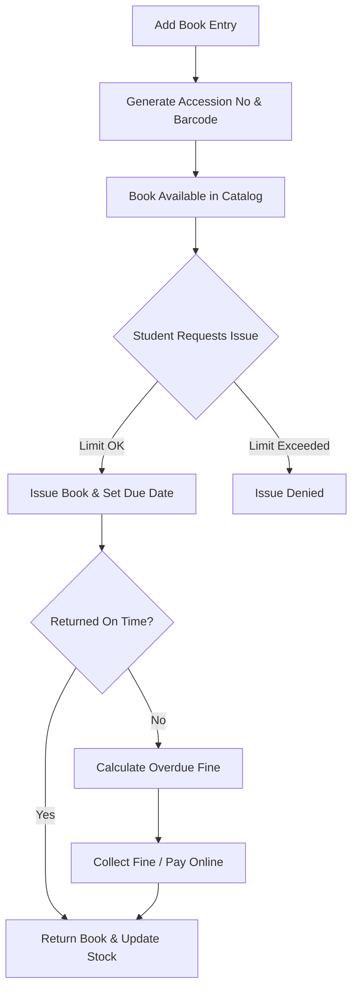

# Library Circulation & Cataloging Workflow

```mermaid
graph TD
  A[Add Book Entry] --> B[Generate Accession No & Barcode]
  B --> C[Book Available in Catalog]
  C --> D{Student Requests Issue}
  D -->|Limit OK| E[Issue Book & Set Due Date]
  D -->|Limit Exceeded| F[Issue Denied]
  E --> G{Returned On Time?}
  G -->|Yes| H[Return Book & Update Stock]
  G -->|No| I[Calculate Overdue Fine]
  I --> J[Collect Fine / Pay Online]
  J --> H
```
