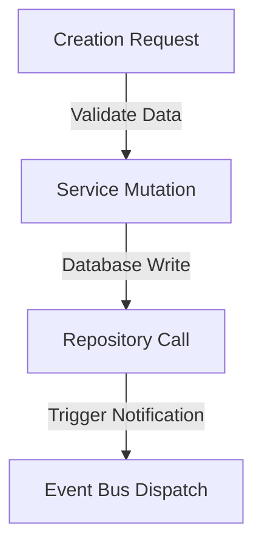

# Module Lifecycle Workflows

Document all workflows for your module in this directory or file.

## Standard Operations Flowchart

```mermaid
graph TD
    A[Creation Request] -->|Validate Data| B[Service Mutation]
    B -->|Database Write| C[Repository Call]
    C -->|Trigger Notification| D[Event Bus Dispatch]
```
