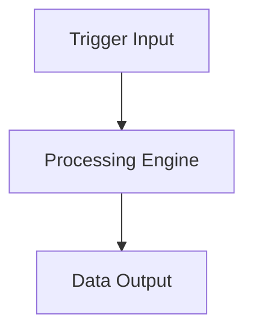

# System Workflow Map

Define your module's flow and cross-module events here using standard Mermaid flowcharts.

```mermaid
graph TD
    A[Trigger Input] --> B[Processing Engine]
    B --> C[Data Output]
```
