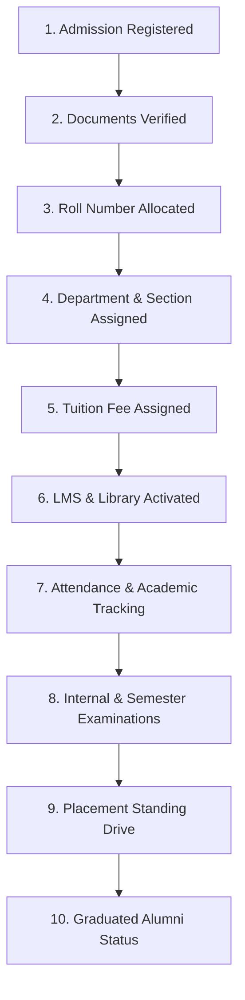
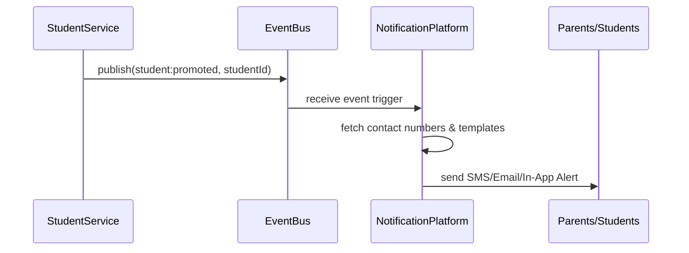

# Student Lifecycle Workflows

This document tracks the comprehensive lifecycle stages of a student record inside the EduSuite Pro ERP.

## Lifecycle Milestones

## Decoupled Event Publication Pipeline

Instead of hardcoupling notifications inside the Students domain, actions publish global events caught by the Notification Platform.

