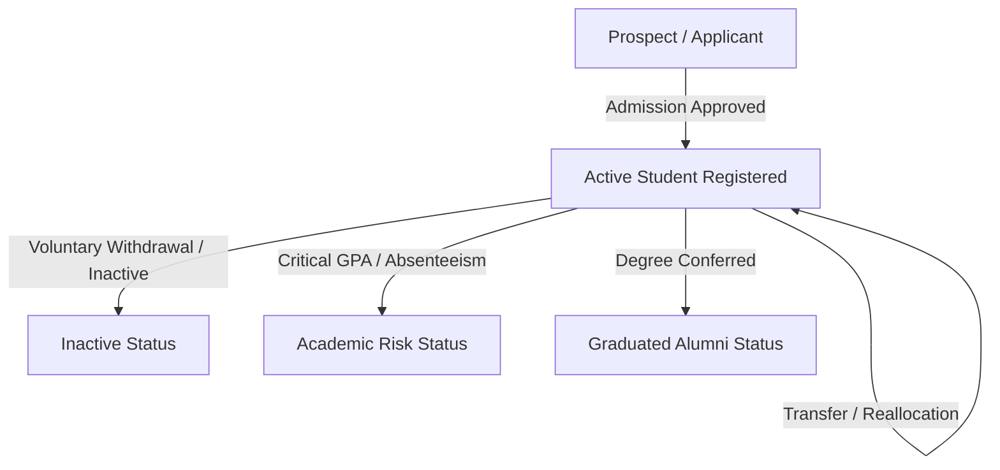

# Student Lifecycle Workflow Standard

This document outlines the standard stages and data flows involved in the student life cycle from admission through graduation or archiving.

## Lifecycle Diagram

## Stage Descriptions

1. **Admission Approval**: Registration validation, Aadhaar/document verification, first fee installment collection.
2. **Active Registration**: Allocation of Roll Number, department assigning, and automated account generation for LMS and Library.
3. **Standing Audits**: Periodic checking of GPA, attendance percentages, and fee status. Records marked as **Risk** when thresholds are breached (e.g. CGPA < 5.0 or attendance < 75%).
4. **Alumni Transition**: Issue of Transfer Certificates, Bonafide transcripts, and archiving data.
