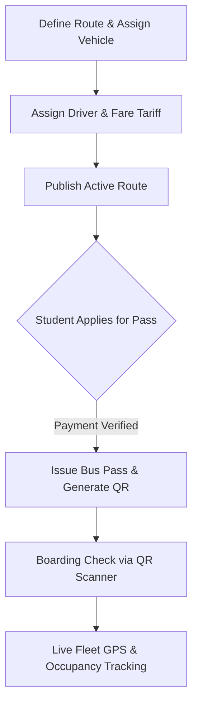

# Transport Operations & Bus Pass Workflow

```mermaid
graph TD
  A[Define Route & Assign Vehicle] --> B[Assign Driver & Fare Tariff]
  B --> C[Publish Active Route]
  C --> D{Student Applies for Pass}
  D -->|Payment Verified| E[Issue Bus Pass & Generate QR]
  E --> F[Boarding Check via QR Scanner]
  F --> G[Live Fleet GPS & Occupancy Tracking]
```
